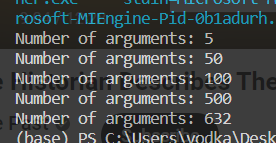
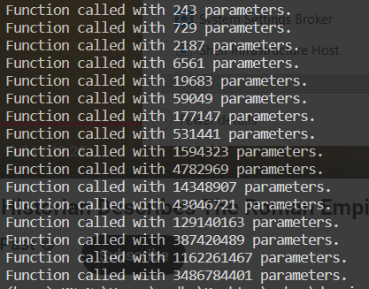

# devoir-cpp

### testing using the regular way 

here we manuly add the number of parametre and run the code we see that even after 256 the code still run 

that mean we need to find an automaticly way to test this 

### testing using another approach 

here we stoepd after all my ram in my pc got full (16gb ram)

we get to the conclustion of the script will run number of args depend of individual pc configuration
